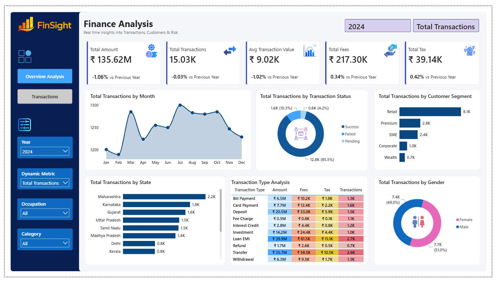
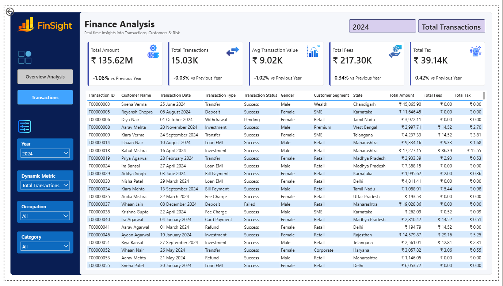

# finance-transaction-analytics
Interactive Power BI dashboard analyzing financial transactions, revenue, fees, taxes, customer segments, transaction trends, and geographic performance.
# Finance Transaction Analytics Dashboard

## 📊 Project Overview

This project presents an interactive Finance Transaction Analytics Dashboard built using Microsoft Power BI.

The dashboard analyzes financial transaction data to provide insights into transaction volume, transaction value, customer segments, transaction status, transaction types, fees, taxes, geographic distribution, and customer demographics.

The report contains two interactive pages:

- **Overview Analysis**
- **Transactions**

The dashboard is designed to provide both a high-level view of financial performance and detailed transaction-level analysis.

---

## 🎯 Project Objective

The objective of this project is to analyze financial transaction data and identify trends and patterns in transaction activity, customer behavior, transaction performance, fees, taxes, and geographic distribution.

The dashboard helps answer questions such as:

- What is the overall transaction volume and value?
- How are transactions changing over time?
- What proportion of transactions are successful, pending, or failed?
- Which customer segments generate the most transactions?
- Which transaction types contribute the highest transaction amounts?
- Which states have the highest transaction activity?
- How much is generated through transaction fees and taxes?
- How are transactions distributed by gender?
- What are the details of individual transactions?

---

## 📌 Key KPIs

The dashboard provides the following key performance indicators:

- **Total Transaction Amount:** ₹135.62M
- **Total Transactions:** 15.03K
- **Average Transaction Value:** ₹9.02K
- **Total Fees:** ₹217.30K
- **Total Tax:** ₹39.14K

---

## 📈 Dashboard Pages

### 1. Overview Analysis

The Overview Analysis page provides a high-level view of financial transaction performance.

It includes:

- Total transaction amount
- Total transaction count
- Average transaction value
- Total fees
- Total tax
- Monthly transaction trends
- Transaction status analysis
- Customer segment analysis
- State-wise transaction analysis
- Transaction type analysis
- Gender-wise transaction analysis
- Interactive filters for year, metric, occupation, and category

---

### 2. Transactions

The Transactions page provides detailed transaction-level information.

It includes:

- Transaction ID
- Customer name
- Transaction date
- Transaction type
- Transaction status
- Gender
- Customer segment
- State
- Total transaction amount
- Total fees
- Total tax

The page also includes interactive filters that allow users to explore the transaction data based on different criteria.

---

## 🔎 Key Insights

### Transaction Status

The majority of transactions were successful, accounting for approximately **85.5%** of total transactions. Pending transactions represented approximately **10.3%**, while failed transactions accounted for approximately **4.2%**.

### Customer Segments

The **Retail** segment recorded the highest transaction volume at approximately **8.1K transactions**, followed by Premium and SME customers.

### Geographic Analysis

**Maharashtra** recorded the highest transaction activity among the states shown in the dashboard, followed by Karnataka and Gujarat.

### Transaction Types

The transaction type analysis shows significant differences in transaction amounts, fees, taxes, and transaction volumes across different financial activities such as Loan EMI, Transfer, Deposit, Card Payment, and Withdrawal.

### Monthly Trends

Transaction activity varied throughout the year, with noticeable changes in monthly transaction volumes. The dashboard allows users to identify periods of higher and lower transaction activity.

---

## 🛠️ Tools & Technologies

- **Microsoft Power BI**
- **DAX**
- Data visualization
- Data modeling
- Interactive dashboards
- KPI analysis
- Slicers and filters

---

## 💡 Power BI Features Used

- KPI cards
- Line charts
- Donut charts
- Bar charts
- Tables
- Interactive slicers
- Dynamic metric selection
- Year filtering
- Cross-filtering and visual interactions
- Conditional formatting
- Dashboard navigation
